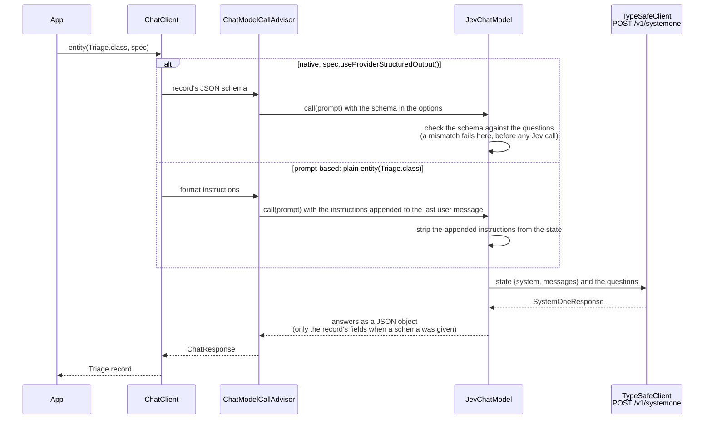

# JevChatModel

A Jev **classifier** behind Spring AI's `ChatModel` interface, so a `ChatClient` can return
typed classifications: which team, how urgent, how severe.

!!! warning "Experimental"
    `JevChatModel` is a prototype, tracked in
    [issue #6](https://github.com/spring-ai-community/spring-ai-typesafe/issues/6). Its name
    and behaviour may change, and it is not auto-configured by the starter.

## A classifier, not a generator

A `ChatModel` normally takes messages and generates a message. Jev takes a state and answers
typed questions with numbers. `JevChatModel` keeps Jev what it is:

- **The questions are fixed when the model is built.** The prompt only supplies the state
  they are answered against. Nothing is inferred from prose.
- **The reply is the answers as a JSON object,** one field per question. `ChatClient.entity(...)`
  maps that straight onto a record.
- **What Jev cannot do is refused, not faked.** It doesn't stream, never calls tools and
  classifies text only. Probabilities and confidence stay in metadata, not in the reply text.

Use it where a fast, deterministic label, flag or level is what the caller needs: routing,
triage, moderation, intent detection, or any step in a workflow that only accepts a
`ChatModel`.

## Quick Start

```java
record Triage(String team, double urgent, double severity) {}

JevChatModel triage = JevChatModel.builder(typeSafeClient)
    .question("team", Choice.builder()
        .instructions("Which team should handle the user's ticket?")
        .option("infra", "Deploys, outages, servers and errors in production")
        .option("billing", "Invoices, payments, refunds and pricing")
        .option("support", "How-to questions and account help")
        .build())
    .question("urgent", Noul.builder()
        .instructions("Does the user's ticket need attention right now?")
        .whenTrue("Customers are affected now")
        .whenFalse("It can wait for normal working hours")
        .build())
    .question("severity", Score.of("How severe is the impact described in the ticket?",
        "Cosmetic", "Degraded for some users", "Full outage"))
    .build();

Triage t = ChatClient.create(triage)
    .prompt()
    .user("Production is down after the 14:00 deploy; every customer gets HTTP 500.")
    .call()
    .entity(Triage.class, spec -> spec.useProviderStructuredOutput());
// e.g. Triage[team=infra, urgent=0.97, severity=1.8]
```

Name each question after the record component its answer should land in.

## Structured output

`ChatClient.entity(...)` asks for JSON in one of two ways, and the difference decides what Jev
sees and what is checked before the call:



`spec.useProviderStructuredOutput()` selects Spring AI's **native** structured output: the
record's JSON schema reaches `JevChatModel` in the options. Prefer it:

- **The state is exactly what the caller wrote.** Nothing is appended to the user message,
  so nothing has to be removed.
- **The record is checked against the questions before any call.** A field with no question
  of the same name fails with an `IllegalArgumentException` that names the field and lists
  the questions. So does a field whose type cannot hold the answer. A choice's label needs a
  `String`, or an enum that contains every option. A noul's or score's value needs a
  floating-point type (`double`, `Double`, `float`); `int` and `boolean` are rejected. Shared
  enums (a `$ref` in the schema) and nullable fields are followed. A field whose schema
  declares no type is accepted without a check.
- **The reply holds exactly the record's fields.** Questions the record does not ask for are
  still answered, and are available in the metadata, but are left out of the reply. That
  keeps `spec.validateSchema()` working, since the schema forbids additional properties.
- **The target must be an object.** A record or class is fine; a `List<...>` target is
  rejected before any call.

With plain `.entity(Triage.class)`, Spring AI uses **prompt-based** structured output instead.
It appends format instructions to the last user message. The default state converter removes
them: a suffix that starts with "Your response should be in JSON format." on its own line
and contains "RFC8259 compliant JSON response". That covers `BeanOutputConverter` and
`MapOutputConverter`. It relies on Spring AI's current wording, there is no schema check, and
the reply contains every answer. `ListOutputConverter` is rejected: it asks for
comma-separated values, which a JSON object cannot satisfy.

## What comes back

The reply is a JSON object, one field per question, in declaration order. With native
structured output it holds only the record's fields.

| Question | Field value | Example |
|---|---|---|
| `Noul` | its truth value, `0..1` | `"urgent": 0.97` |
| `Choice` | the selected label | `"team": "infra"` |
| `Score` | its value on the rubric, `0..` highest level | `"severity": 1.8` |

```java
String json = ChatClient.create(triage).prompt().user(ticket).call().content();
// {"team":"infra","urgent":0.97,"severity":1.8}
```

The full `SystemOneResponse`, with every answer, probability and confidence, is in the
generation metadata. The response metadata carries the model, the token usage and the
request id:

```java
ChatResponse response = ChatClient.create(triage).prompt().user(ticket).call().chatResponse();

SystemOneResponse jev = response.getResult().getMetadata().get(JevChatModel.RESPONSE_METADATA_KEY);
double infra = jev.choice("team").probabilityOf("infra");

response.getMetadata().getModel();                    // e.g. jev-1.13.0
response.getMetadata().getUsage().getPromptTokens();  // e.g. 210
```

## What Jev sees

By default, the prompt becomes this state:

```json
{
  "system": "Tickets come from enterprise customers.",
  "messages": [ { "role": "user", "content": "Production is down after ..." } ]
}
```

- **`system`** (`JevChatModel.SYSTEM_FIELD`) holds every system message, joined with a blank
  line. It is left out when there are none.
- **`messages`** (`JevChatModel.MESSAGES_FIELD`) holds the user and assistant turns, in order.
- **Format instructions:** on the prompt-based path, the instructions appended to the
  **last** user message are removed, as described
  [above](#structured-output). Earlier messages, and a message that only quotes the
  instruction text, are left untouched.
- **Media:** a message carrying media is rejected with `IllegalArgumentException`. Jev
  classifies text.

Write question instructions in terms of that state, for example "the user's ticket". To
judge a different shape, supply your own converter:

```java
JevChatModel.builder(typeSafeClient)
    .questions(questions)
    .stateConverter(prompt -> JsonContent.of(Map.of("ticket",
        JevChatModel.withoutFormatInstructions(prompt.getUserMessage().getText()))))
    .build();
```

A custom converter receives the prompt as sent. On the prompt-based path that includes the
appended format instructions, so remove them with `JevChatModel.withoutFormatInstructions`,
as above, or use native structured output.

## Builder Configuration

| Builder method | Default | Description |
|---|---|---|
| `question(String, Question)` | — (**at least one**) | A question every call answers. The name is the reply's field. |
| `questions(Map<String, ? extends Question>)` | — | Several questions at once, in map order. |
| `stateConverter(Function<Prompt, JsonContent>)` | `JevChatModel::defaultState` | How a prompt becomes the state. |
| `answerRenderer(Function<SystemOneResponse, String>)` | `JevChatModel::answersAsJson` | How the answers become the reply's text. A custom renderer owns the reply's shape, so the native schema check is skipped. |
| `observationRegistry(ObservationRegistry)` | `ObservationRegistry.NOOP` | Observe each call; see [observability](#observability). |
| `observationConvention(ChatModelObservationConvention)` | `DefaultChatModelObservationConvention` | Replace the observation's name and key values. |

The model named in the prompt's `ChatOptions` is used when set; otherwise the client's
default model.

## What it refuses

| Chat-model feature | `JevChatModel` |
|---|---|
| `stream(...)` | errors with `UnsupportedOperationException`. Jev answers every question at once. |
| Tools given to `ChatClient` | dropped. `getOptions()` are not tool-calling options, so `ChatClient` never starts its tool loop. |
| A `Prompt` carrying tool callbacks directly | rejected with `IllegalArgumentException`. |
| Media in a message | rejected with `IllegalArgumentException`. |
| List output (`ListOutputConverter`) | rejected with `IllegalArgumentException`. |
| Temperature, top-p, max tokens | ignored; Jev has no such settings. |

Advisors still run. Memory or retrieval advisors only add text to the state, though; they
don't make Jev generate anything.

## Observability

Each call is observed like any other Spring AI chat model: a `gen_ai.client.operation`
observation, contextually named `chat <model>`.

| Key | Value |
|---|---|
| `gen_ai.operation.name` | `chat` |
| `gen_ai.system` | `typesafe` (`JevChatModel.PROVIDER`) |
| `gen_ai.request.model` | the model sent, the client's default when the prompt names none |
| `gen_ai.response.model` | the model that answered, e.g. `jev-1.13.0` |
| `gen_ai.response.id` | the request id |
| `gen_ai.response.finish_reasons` | always `["STOP"]` |
| `gen_ai.usage.input_tokens` / `output_tokens` / `total_tokens` | the token counts Jev reports |

Request settings such as temperature are recorded when the caller sets them, even though Jev
ignores them.

With Spring AI's `ChatModelMeterObservationHandler` registered, token usage is also recorded
as `gen_ai.client.token.usage`, tagged `gen_ai.token.type` `input`, `output` or `total`. The
SDK's retries happen inside the one observation. When the client is built from Spring Boot's
`RestClient.Builder`, each HTTP attempt is also recorded as `http.client.requests`.

```java
JevChatModel.builder(typeSafeClient)
    .questions(questions)
    .observationRegistry(observationRegistry)
    .build();
```

## With Spring Boot

Expose a `ChatClient` built on the model, **not** the model itself. Pass the
`ObservationRegistry` to both, so the `ChatClient` and advisor observations are recorded
alongside the model's:

```java
@Bean
ChatClient triageClient(TypeSafeClient typeSafeClient, ObservationRegistry observationRegistry) {
    JevChatModel triage = JevChatModel.builder(typeSafeClient)
        .questions(TRIAGE_QUESTIONS)
        .observationRegistry(observationRegistry)
        .build();
    return ChatClient.create(triage, observationRegistry);
}
```

!!! warning "Do not declare a `JevChatModel` bean"
    A `JevChatModel` is a `ChatModel`. Declared as a bean next to the application's real
    model, for example Anthropic's, it makes two `ChatModel` beans. Then any injection of
    Spring AI's auto-configured `ChatClient.Builder`, or of a bare `ChatModel`, fails with
    `NoUniqueBeanDefinitionException`. Marking one of them `@Primary` doesn't help: every
    other `ChatClient` would silently use that model. Build the model inside the method that
    creates its `ChatClient`, as above, and inject that client by name.

The `TypeSafeClient` comes from the
[Spring Boot starter](../client/SpringBootStarter.md), already configured with the API key,
base URL and Boot's `RestClient.Builder`.

## When to use something else

- A verdict on a model's answer, with thresholds and feedback: [`JevJudge`](../judge/JevJudge.md).
- Judging and retrying inside a chat call: [`JevSelfRefineAdvisor`](../judge/JevSelfRefineAdvisor.md).
- Choosing tools: [`JevToolIndex`](../toolsearch/JevToolIndex.md).
- No `ChatClient` needed: call [`TypeSafeClient`](../client/TypeSafeClient.md) directly. It is
  the same request, without the adapter.

## See Also

- [The Three Primitives](../concepts/primitives.md)
- [Confidence](../concepts/confidence.md) — what the probabilities in the metadata mean
- [Issue #6](https://github.com/spring-ai-community/spring-ai-typesafe/issues/6) — open questions
