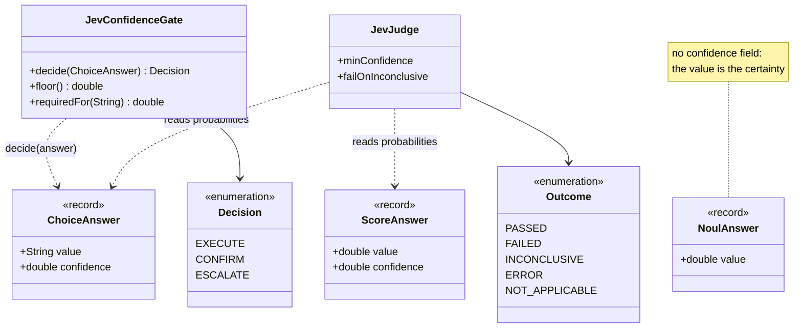
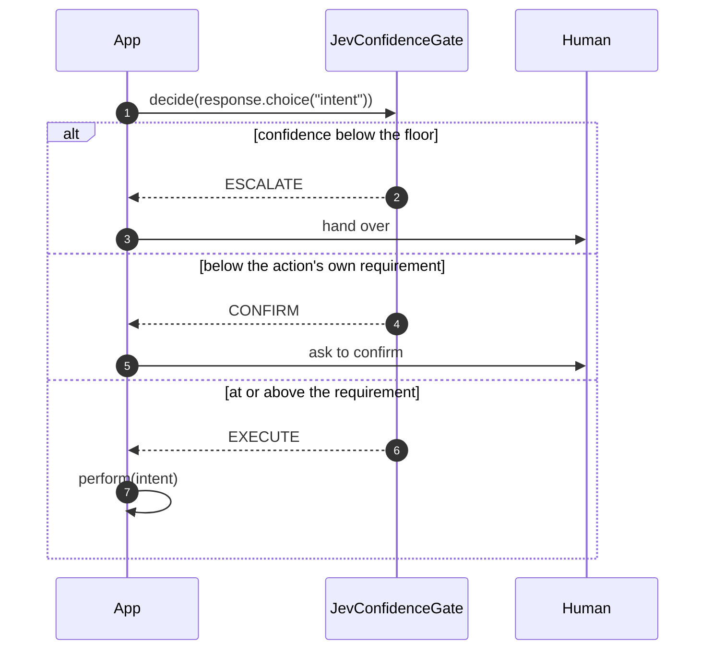

# Confidence

Confidence is a second axis. **The answer tells you what; confidence tells you whether to
act on it unattended.**

## What it actually measures

Confidence is a statistic over the answer's own probability distribution — how concentrated
it is. A flat distribution means the options or levels did not separate well *for this
input*.

That is not the same as the answer being wrong. It means the question did not decide
cleanly, which is a different problem and wants a different response: not "reject this
answer", but "do not let software act on this one alone".

!!! note "Nouls carry no confidence, by design"
    A noul's value already *is* its certainty. A `0.5` is the undecided case, so there is
    nothing a separate statistic would add. Only `Choice` and `Score` report confidence.

## Where confidence lives

Confidence is a field on the answer, not something you compute. Two of the four answer
records carry it, and the gate and the judge are the two things that read it — the judge
from either kind, the gate through `decide(ChoiceAnswer)` or the raw
`decide(action, confidence)` overload:



## Confidence-gated routing

Tier your thresholds by what the action costs when it is wrong. A universal floor keeps
anything genuinely undecided away from automation; above it, expensive actions demand more
than cheap ones.

[`JevConfidenceGate`](../patterns/JevConfidenceGate.md) holds that policy in one place:

```java
JevConfidenceGate gate = JevConfidenceGate.builder()
    .floor(0.60d)                    // nothing acts unattended below this
    .require("transfer_funds", 0.85d) // this one costs more when wrong
    .build();

switch (gate.decide(response.choice("intent"))) {
    case EXECUTE  -> perform(intent);
    case CONFIRM  -> askTheUserToConfirm(intent);
    case ESCALATE -> handOverToAHuman();
}
```



The two thresholds are independent: the floor is about the answer being undecided at all,
the per-action requirement is about what the action costs when it is wrong.

| Confidence | Low-stakes action | High-stakes action |
|------------|-------------------|--------------------|
| below the floor | escalate | escalate |
| floor … requirement | execute | ask the user to confirm |
| at or above requirement | execute | execute |

## Confidence in the judge

[`JevJudge`](../judge/JevJudge.md) makes a pass/fail decision, so it asks a narrower
question than the answer's `confidence` does. Not *how concentrated is the distribution?* but
*how much of it supports this verdict?*: the probability on the verdict's side of the
threshold. The two differ when the mass is split between levels that all pass, or all fail.
`{2: 0.52, 3: 0.41}` against a `minimum` of 2 has a `confidence` near 0.5, yet 93% of it
supports the pass.

A criterion whose verdict is not supported by enough probability is **undecided, not
failed**. It is reported as `INCONCLUSIVE` and does not block:

```java
JevJudge judge = JevJudge.builder(typeSafeClient)
    .score("helpfulness", rubric, 2.0d)
    .minConfidence(0.6d)          // the default: a clear majority must support the verdict
    .failOnInconclusive(false)    // the default: undecided does not block
    .build();
```

`JevConfidenceGate` still reads `confidence` itself, because routing an action is a different
decision: there, how clearly *one* option won is exactly the question.

Turn `failOnInconclusive(true)` on where shipping an unverified answer is worse than
failing. Leaving it off is right when an occasional unverifiable answer is acceptable and
a false rejection is not.

## Stability is a different question

Confidence describes one answer. It says nothing about whether you would get the same answer
again — and a value that lands near a threshold may be noise rather than judgement.

[`JevConsistency`](../patterns/JevConsistency.md) answers that by sampling:

```java
JevConsistency.Report report = JevConsistency.sample(client, state, questions, 15);

// The questions whose samples straddle the threshold you are about to rely on
List<String> shaky = report.unstableAt(0.70d);
```

A criterion whose samples fall on both sides of its threshold makes a decision that is not
reproducible. Either move the threshold, sharpen the question, or route that case to a
human.

## See Also

- [JevConfidenceGate](../patterns/JevConfidenceGate.md) — the gate as a reusable policy
- [JevConsistency](../patterns/JevConsistency.md) — measuring stability across samples
- [The Three Primitives](primitives.md)
- [TypeSafe confidence documentation](https://docs.typesafe.ai/confidence)
