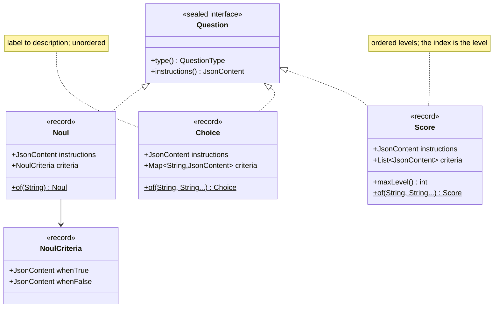
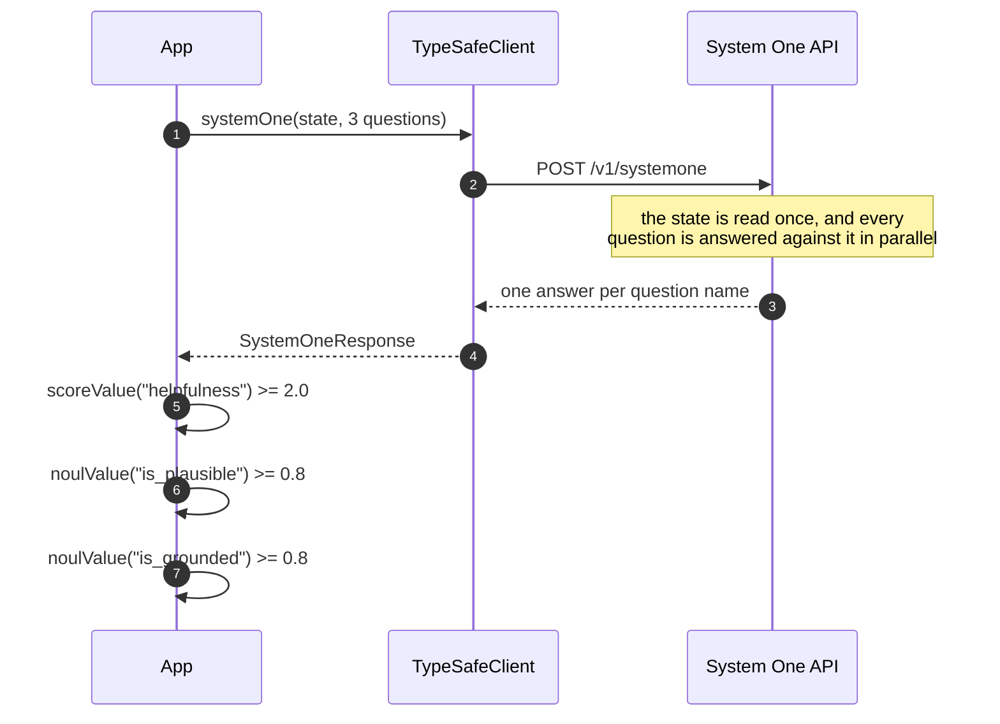
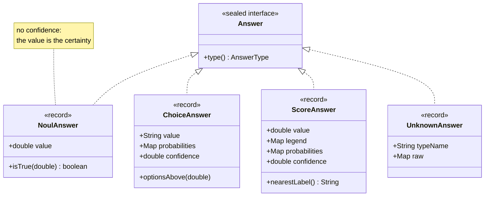

# The Three Primitives

Every question you ask Jev is one of three shapes. Each answers differently, and each is
thresholded differently — which is the whole reason to pick deliberately between them.

| Primitive | Ask | Get back |
|-----------|-----|----------|
| `Noul` | a yes/no question | `noul`, a truth value in `[0, 1]`. **No confidence** — the value already *is* the certainty, so it is thresholded directly. |
| `Choice` | pick one label | `choice`, `probabilities` per label, `confidence` |
| `Score` | place on an ordered rubric | `score` (probability-weighted, continuous), `legend`, `probabilities` per level, `confidence` |

All three carry the same two fields — `instructions` and `criteria`. What differs is the
*shape* of `criteria`, and that shape is what makes each primitive answer the way it does:



`Question` is sealed and permits exactly these three, so a `switch` over a question is
exhaustive without a default branch.


## Noul

A yes/no question whose answer is a probability rather than a boolean. There is no separate
confidence, because a noul of `0.5` already tells you the model is undecided.

```java
Noul urgent = Noul.of("Does this convey urgency?");

double value = response.noulValue("is_urgent");     // 0.95
boolean act  = response.noul("is_urgent").isTrue(0.8);
```

Adding `whenTrue` and `whenFalse` descriptions is what turns a vague question into a usable
one. They also become the defect text a judge feeds back, so write them as statements about
the state rather than instructions to a model:

```java
Noul plausible = Noul.builder()
    .instructions("Are all the numeric values physically plausible for their units?")
    .whenTrue("Every value is within a range that can actually occur")
    .whenFalse("At least one value is impossible, such as a temperature below absolute zero")
    .build();
```

## Choice

Pick exactly one label from a fixed set. You get the selected label, a probability for every
option, and a confidence derived from how concentrated that distribution is.

```java
Choice department = Choice.builder()
    .instructions("Which team should handle this?")
    .option("billing",   "Payments, invoicing, refunds")
    .option("technical", "Bugs, outages, integrations")
    .option("sales",     "Pricing, upgrades, new accounts")
    .build();

String label            = response.choiceValue("department");            // "billing"
double confidence       = response.choice("department").confidence();    // 0.82
double billingOdds      = response.choice("department").probabilityOf("billing");
List<String> plausible  = response.choice("department").optionsAbove(0.1); // descending
```

!!! warning "Probabilities always sum to one"
    A choice will *always* name a winner, even when none of the options fit. If "none of
    these" is a real outcome in your domain, ask it as a separate `Noul` alongside the
    choice — that is exactly what [`JevToolIndex`](../toolsearch/JevToolIndex.md) does to
    decide that no tool applies.

## Score

Place the state on an ordered rubric you define. The value is **continuous and
probability-weighted**, not a rounded level: a `1.1` on a three-level rubric sits just past
`Frustrated`, leaning toward `Very angry`.

```java
Score frustration = Score.builder()
    .instructions("How frustrated is the customer?")
    .level("Calm, just stating facts")
    .level("Frustrated but civil")
    .level("Very angry, strong language")
    .build();

double value      = response.scoreValue("frustration");            // 1.1
String label      = response.score("frustration").nearestLabel();  // "Very angry"
int level         = response.score("frustration").nearestLevel();  // 2
JsonContent first = response.score("frustration").labelOf(0);      // "Calm, just stating facts"
```

Because the value is continuous, a threshold of `2.0` is a real threshold and not a rounding
artefact. Keep the levels genuinely ordered — if two levels are alternatives rather than
degrees, you want a `Choice`.

## Atomic questions, composed in code

The most important habit is asking several narrow questions instead of one broad one. They
cost almost nothing extra: the service reads the state once and answers every question in
the call in parallel, so a third question is far cheaper than a third call.

```java
Map<String, Question> questions = Map.of(
    "helpfulness",  helpfulnessRubric,   // Score
    "is_plausible", plausibilityCheck,   // Noul
    "is_grounded",  groundednessCheck);  // Noul

SystemOneResponse response = client.systemOne(state, questions);
```



A third question costs a fraction of a third call, which is why the habit pays.

The payoff is that each answer keeps its own threshold. An answer that is fluent and exactly
on topic but quotes an impossible temperature fails on `is_plausible` alone — a single
overall rating would average that problem away into a middling score.

### Speculative questions

Since questions are free-ish, ask ones you might not need. `bug_severity` only matters if a
ticket turns out to be a technical report, but which it is is what the call is working
out — so ask both and let your code decide what to read:

```java
switch (response.choiceValue("department")) {
    case "technical" -> handleBug(response.scoreValue("bug_severity"));
    case "billing"   -> handleBilling(response.noulValue("refund_requested"));
    default          -> route(response);
}
```

## Structured state and instructions

`state`, `instructions` and every `criteria` description accept a string, a JSON object, a
JSON array or `null` — the documentation's `EntryType`. That union is modelled as
`JsonContent`, and every builder method is overloaded for `String`, `Map`, `List` and
`JsonContent`:

```java
Noul.builder()
    .instructions(Map.of(
        "question", "Does the `message` ask the recipient to disclose a credential?",
        "inspect",  "message",
        "focus",    "A request to send the credential, not to reset it."))
    .whenTrue(Map.of(
        "what",     "Asks the recipient to reply with a password, PIN or one-time code",
        "examples", List.of("Reply with your password", "Send us the 6-digit code")))
    .whenFalse("No sensitive credential is requested")
    .build();
```

Naming a field of the state in the instructions (`inspect: "message"`) is how you point a
question at one part of a structured state instead of the whole thing.

### What you can put in a `JsonContent`

`JsonContent.of(...)` takes any `Object`, and serialization goes through Jackson — so a
domain object works as state, including one carrying its own `@JsonValue`:

```java
record Money(String currency, long cents) {
    @JsonValue String toJson() { return currency + " " + cents; }
}

client.systemOne(Map.of("invoice", invoice, "paid", new Money("EUR", 1250)), questions);
// state -> {"invoice": {...}, "paid": "EUR 1250"}
```

What matters is the JSON a value **produces**, not its Java type. `EntryType` is a string,
an object, an array or null, and the API answers `422` for anything else:

| Wrapped value | Serializes as | Accepted |
|---|---|---|
| `String`, `Map`, `List` | string, object, array | ✅ |
| a record or POJO | object | ✅ |
| an `enum` | string | ✅ |
| a `@JsonValue` type returning a string or object | string or object | ✅ |
| `java.time` values (`Instant`, `LocalDate`, …) | string | ✅ |
| `Number`, `Boolean` | number, boolean | ❌ `422 Input should be a valid string` |
| a `@JsonValue` type returning a number or boolean | number, boolean | ❌ `422` |

Whether a POJO is valid is a question about its JSON, which only Jackson can answer, so it
is not checked when you wrap it — an invalid one surfaces as a
`TypeSafeUnprocessableEntityException` on the call.

!!! note "The accessors report the Java value, not the JSON"
    `asText()`, `asMap()` and `asList()` are `instanceof` checks. A `Money` serializes to a
    JSON string but is not a `String`, so `asText()` answers `null` and `asMap()` answers an
    empty map. For the Jackson view use `as(Class, JsonMapper)`, which honours `@JsonValue` —
    `money.as(String.class, mapper)` gives `"EUR 1250"`, while converting it to `Map` throws,
    because as far as Jackson is concerned it *is* a string.

    `toDisplayString()` does render the JSON, since that text is quoted back to a model as
    part of judge feedback and has to describe what was actually sent.

## Answers are a sealed hierarchy

`NoulAnswer`, `ChoiceAnswer`, `ScoreAnswer` and `UnknownAnswer`. The last is the
forward-compatibility escape hatch: a primitive added to Jev after this SDK version arrives
as raw JSON rather than failing the call.



The maps are keyed by what the primitive ranks: `ChoiceAnswer.probabilities` by option
label, `ScoreAnswer.probabilities` and `legend` by level index. Note also which records carry
`confidence` and which does not — that asymmetry is deliberate, and is the subject of
[Confidence](confidence.md).

```java
Answer answer = response.answer("department");
if (answer instanceof ChoiceAnswer choice && choice.confidence() >= 0.8) {
    route(choice.value());
}
```

## See Also

- [Confidence](confidence.md) — when to act on an answer automatically
- [JevJudge](../judge/JevJudge.md) — composing criteria into a pass/fail verdict
- [TypeSafe primitives documentation](https://docs.typesafe.ai/primitives)
