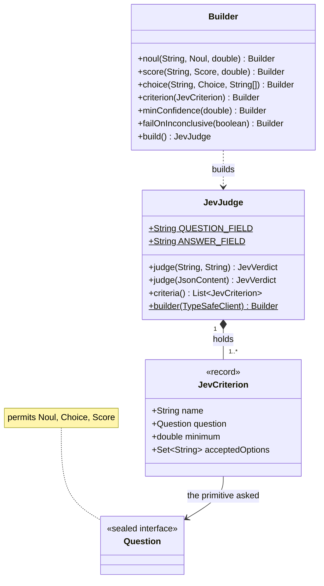
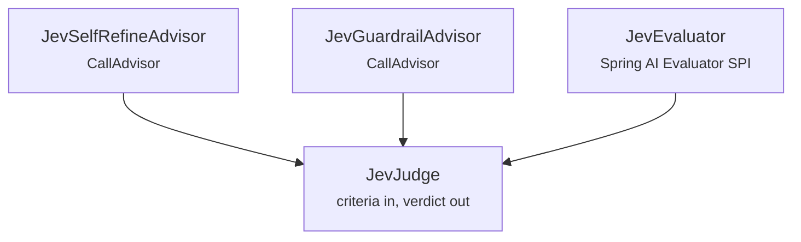
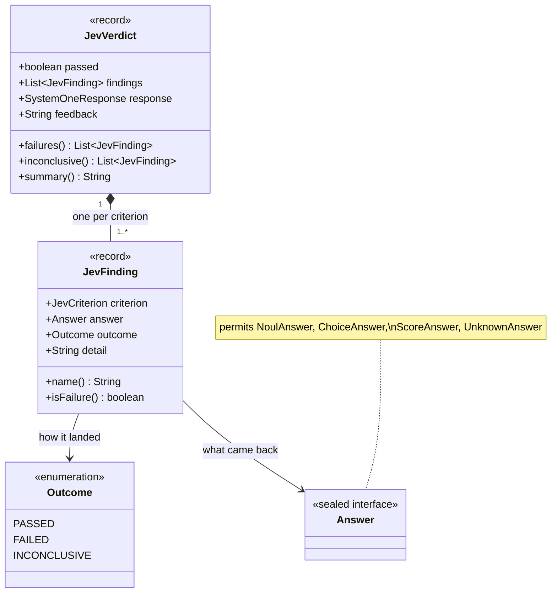

# JevJudge

A Model-as-a-judge built out of atomic questions rather than one rubric prompt. Every
criterion is answered against the same state in a single call, in parallel, and each keeps
its own threshold.

## What it does

A judge holds a list of criteria. Each is a [primitive](../concepts/primitives.md) plus what
counts as passing it:

- a **noul** passes when its truth value reaches a minimum
- a **score** passes when it reaches a level on your rubric
- a **choice** passes when the selected label is one you accept

`judge(...)` sends them all in one request and returns a `JevVerdict`: whether everything
passed, a finding per criterion, the raw response, and feedback synthesised from the
criteria that did not.

## Class diagram

A judge is built from criteria, and each criterion pairs a
[primitive](../concepts/primitives.md) with its own pass condition:



The shape to take from this: a judge is **a list of criteria and nothing else**. It holds a
`TypeSafeClient` and spends exactly one call per `judge(...)`, whatever the number of
criteria — see [what comes back](#reading-the-verdict) for the other half.

## How JevJudge, the advisor and the evaluator fit together

These three are a **hub and two spokes**, not a chain. `JevJudge` is the engine; the other
two are independent adapters that put it behind a Spring AI extension point. Neither spoke
uses the other.



| Type | Use it when |
|------|-------------|
| `JevJudge` (this page) | you want a verdict in your own code, with the per-criterion findings |
| [`JevSelfRefineAdvisor`](JevSelfRefineAdvisor.md) | a `ChatClient` should judge its own answer and retry when it falls short |
| [`JevGuardrailAdvisor`](../guardrails/JevGuardrailAdvisor.md) | a turn should be refused rather than retried — an unsafe answer is not a draft |
| [`JevEvaluator`](JevEvaluator.md) | existing code is written against Spring AI's `Evaluator`, and you want Jev behind it |

`JevGuardrailAdvisor` is the odd one out: it builds its own hazard batteries rather than
taking a `JevJudge`, because the questions and thresholds are prescribed by the guardrail
policy rather than supplied per use.

## Why not just ask a chat model

Spring AI ships `RelevancyEvaluator` and `FactCheckingEvaluator`. Both prompt a second chat
model and come down to:

```java
if ("yes".equalsIgnoreCase(normalizedResponse)) { passing = true; score = 1; }
```

That fails in two directions. The model may answer in a form the parser does not expect, and
one yes-or-no cannot say *which* of several things was wrong. A judge built from typed
questions cannot come back malformed, and keeps the dimensions separate.

| | A judge model | `JevJudge` |
|---|---|---|
| **Verdict** | prose to parse | typed answers |
| **Dimensions** | one overall rating | one threshold per criterion |
| **Cost of a third check** | a third prompt, or a longer one | negligible — same call |
| **Feedback** | generated, varies run to run | synthesised from your own rubric |
| **Undecided** | indistinguishable from failed | reported as `INCONCLUSIVE` |

## Quick Start

```java
JevJudge judge = JevJudge.builder(typeSafeClient)
    .score("helpfulness", Score.builder()
        .instructions("How well does `assistant_answer` address `user_question`?")
        .level("Terrible: irrelevant or off-topic")
        .level("Mostly unhelpful: misses the main point")
        .level("Mostly helpful: minor gaps remain")
        .level("Excellent: fully and correctly addressed")
        .build(), 2.0d)
    .noul("is_plausible", Noul.builder()
        .instructions("Are the numeric values in `assistant_answer` physically plausible?")
        .whenFalse("At least one value is impossible")
        .build(), 0.7d)
    .minConfidence(0.5d)
    .build();

JevVerdict verdict = judge.judge(question, answer);

if (!verdict.passed()) {
    System.out.println(verdict.feedback());
}
```

## The state a judge builds

`judge(String question, String answer)` builds a two-field state:

```json
{ "user_question": "...", "assistant_answer": "..." }
```

Those field names are `JevJudge.QUESTION_FIELD` and `JevJudge.ANSWER_FIELD` — write your
instructions against them, as the example above does.

For anything that is not a question-and-answer pair, pass the state yourself:

```java
JevVerdict verdict = judge.judge(JsonContent.of(Map.of(
        "passage", retrievedText,
        "claim",   claimUnderTest)));
```

## Builder Configuration

| Builder method | Type | Default | Description |
|---|---|---|---|
| `noul(String, Noul, double)` | — | — | A criterion passing at or above a truth value. |
| `score(String, Score, double)` | — | — | A criterion passing at or above a rubric level. |
| `choice(String, Choice, String...)` | — | — | A criterion passing when the label is accepted. Validates the labels exist on the choice. |
| `criterion(JevCriterion)` | — | — | Add a pre-built criterion. |
| `minConfidence(double)` | `double` | `0.5` | Below this, a choice or score is `INCONCLUSIVE`. Nouls carry no confidence and are unaffected. |
| `failOnInconclusive(boolean)` | `boolean` | `false` | Treat an undecided criterion as a failure. |
| `feedbackRenderer(Function<List<JevFinding>, String>)` | — | `JevJudge::defaultFeedback` | Replace the wording fed back to the model. |

Criterion names must be unique, and a judge needs at least one.

## Reading the verdict

`judge(...)` returns one verdict carrying one finding per criterion, so the dimensions stay
separate rather than collapsing into a number:



`response` is the untouched `SystemOneResponse`, so the usage counts and the request id are
there when you need them.

```java
public record JevVerdict(boolean passed, List<JevFinding> findings,
                         SystemOneResponse response, String feedback) {
    List<JevFinding> failures();
    List<JevFinding> inconclusive();
    String summary();   // passed=false [helpfulness=PASSED, is_plausible=FAILED]
}
```

Each `JevFinding` carries its criterion, the raw answer, an `Outcome` of `PASSED`, `FAILED`
or `INCONCLUSIVE`, and a `detail` sentence ready to hand back to a model.

```java
verdict.failures().forEach(finding ->
        log.warn("{} failed: {}", finding.name(), finding.detail()));
```

## Feedback is synthesised, not generated

Jev returns numbers, never prose, so the feedback is built by the SDK from the answer and
the rubric you wrote. It is deterministic and more specific than a judge model's commentary:

```
helpfulness: rated "Mostly unhelpful: misses the main point" (1.20), needs to reach 2.00
which is "Mostly helpful: minor gaps remain"
```

Two details worth knowing. The level quoted is the one the *score* lands on, not the most
probable level — the two can disagree on a spread distribution, and quoting a label that
contradicts the number would be worse than useless. And the wording is formatted with
`Locale.ROOT`, so `0.70` does not become `0,70` on a comma-decimal JVM and change what the
model reads.

## Low confidence is undecided, not failed

A flat distribution means the levels or options did not separate well *for this state*,
which is not the same as the answer being wrong. Those criteria are `INCONCLUSIVE` and do
not block, unless you set `failOnInconclusive(true)`.

A criterion the service returns no answer for degrades the same way rather than throwing —
a partial response should cost you that one criterion, not the whole call.

## See Also

- [JevSelfRefineAdvisor](JevSelfRefineAdvisor.md) — judge and retry inside a `ChatClient`
- [JevEvaluator](JevEvaluator.md) — the same judge behind Spring AI's `Evaluator` SPI
- [Confidence](../concepts/confidence.md)
- [The Three Primitives](../concepts/primitives.md)
