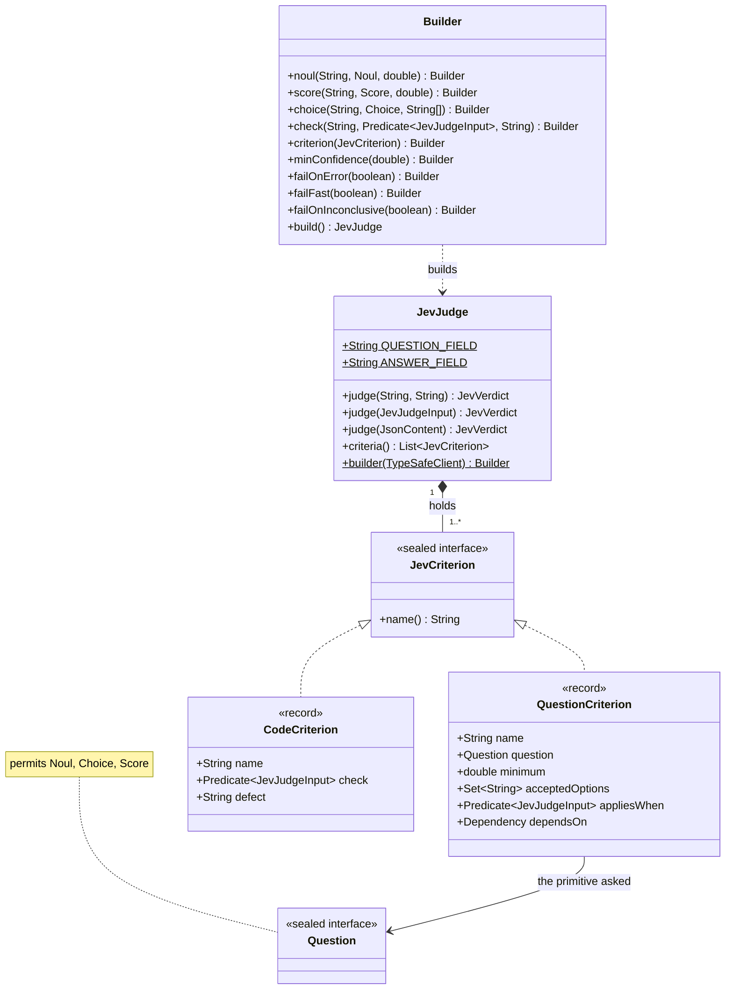
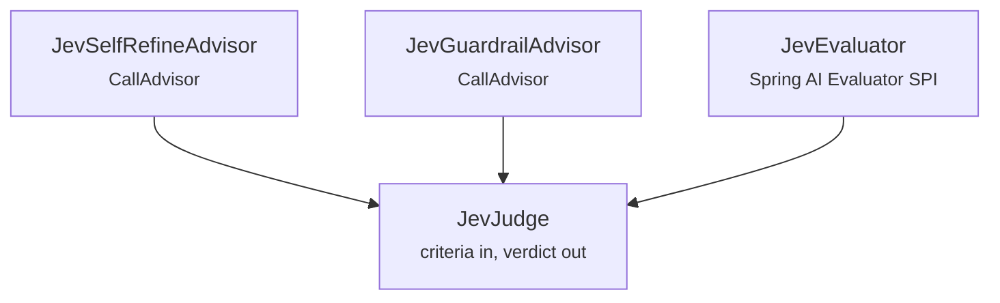
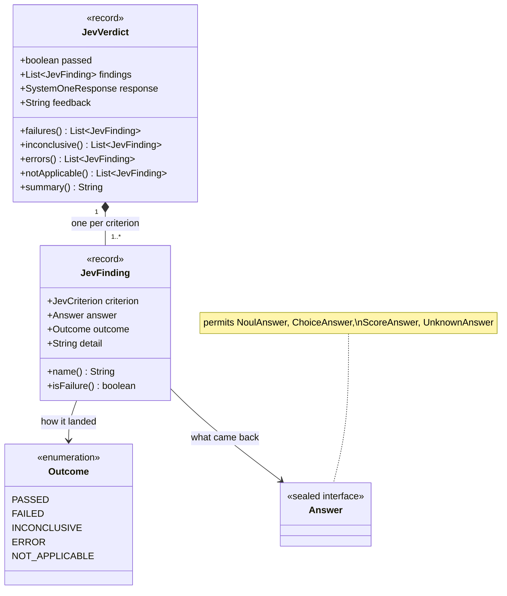

# JevJudge

A Model-as-a-judge built out of atomic questions rather than one rubric prompt. Every
criterion is answered against the same state in a single call, in parallel, and each keeps
its own threshold.

## What it does

A judge holds a list of criteria. Most are a [primitive](../concepts/primitives.md) plus what
counts as passing it:

- a **noul** passes when its truth value reaches a minimum
- a **score** passes when it reaches a level on your rubric
- a **choice** passes when the selected label is one you accept

The rest are [**code checks**](#code-criteria): plain Java predicates for anything the input
already settles, such as whether a tool was called. They never reach Jev.

`judge(...)` sends every question in one request and returns a `JevVerdict`: whether everything
passed, a finding per criterion, the raw response, and feedback synthesised from the
criteria that did not.

## Class diagram

A judge is built from criteria, and each criterion pairs a
[primitive](../concepts/primitives.md) with its own pass condition:



The shape to take from this: a judge is **a list of criteria and nothing else**. It holds a
`TypeSafeClient` and spends at most one call per `judge(...)`, whatever the number of
criteria. It makes none when no question applies, or when `failFast` skips it. Code checks run locally and add nothing to that — see [what comes back](#reading-the-verdict) for the other half.

## How JevJudge, the advisor and the evaluator fit together

These three are a **hub and two spokes**, not a chain. `JevJudge` is the engine; the other
two are independent adapters that put it behind a Spring AI extension point. Neither spoke
uses the other.



| Type | Use it when |
|------|-------------|
| `JevJudge` (this page) | you want a verdict in your own code, with the per-criterion findings |
| [`JevSelfRefineAdvisor`](JevSelfRefineAdvisor.md) | a `ChatClient` should judge its own answer and retry when it falls short |
| [`JevGuardrailAdvisor`](../guardrails/JevGuardrailAdvisor.md) | a turn should be refused rather than retried — an unsafe answer is not a draft |
| [`JevEvaluator`](JevEvaluator.md) | existing code is written against Spring AI's `Evaluator`, and you want Jev behind it |

`JevGuardrailAdvisor` is the odd one out: it builds its own hazard batteries rather than
taking a `JevJudge`, because the questions and thresholds are prescribed by the guardrail
policy rather than supplied per use.

## Why not just ask a chat model

Spring AI ships `RelevancyEvaluator` and `FactCheckingEvaluator`. Both prompt a second chat
model and come down to:

```java
if ("yes".equalsIgnoreCase(normalizedResponse)) { passing = true; score = 1; }
```

That fails in two directions. The model may answer in a form the parser does not expect, and
one yes-or-no cannot say *which* of several things was wrong. A judge built from typed
questions cannot come back malformed, and keeps the dimensions separate.

| | A judge model | `JevJudge` |
|---|---|---|
| **Verdict** | prose to parse | typed answers |
| **Dimensions** | one overall rating | one threshold per criterion |
| **Cost of a third check** | a third prompt, or a longer one | negligible — same call |
| **Feedback** | generated, varies run to run | synthesised from your own rubric |
| **Undecided** | indistinguishable from failed | reported as `INCONCLUSIVE` |
| **Could not judge** | indistinguishable from failed | reported as `ERROR` |

## Quick Start

```java
JevJudge judge = JevJudge.builder(typeSafeClient)
    .score("helpfulness", Score.builder()
        .instructions("How well does `assistant_answer` address `user_question`?")
        .level("Terrible: irrelevant or off-topic")
        .level("Mostly unhelpful: misses the main point")
        .level("Mostly helpful: minor gaps remain")
        .level("Excellent: fully and correctly addressed")
        .build(), 2.0d)
    .noul("is_plausible", Noul.builder()
        .instructions("Are the numeric values in `assistant_answer` physically plausible?")
        .whenFalse("At least one value is impossible")
        .build(), 0.7d)
    .build();

JevVerdict verdict = judge.judge(question, answer);

if (!verdict.passed()) {
    System.out.println(verdict.feedback());
}
```

## The state a judge builds

`judge(String question, String answer)` builds a two-field state:

```json
{ "user_question": "...", "assistant_answer": "..." }
```

When there is more to judge against, build a `JevJudgeInput`. Its fields become the state
under fixed names, the same wherever a judge is used, so write your instructions against
them:

| Builder method | State field | Shape |
|---|---|---|
| `question(String)` | `user_question` | string |
| `answer(String)` | `assistant_answer` | string |
| `expected(Object)` | `expected_output` | any JSON value: the reference to judge against |
| `context(String)` / `context(List<String>)` | `supporting_context` | array, one entry per document |
| `toolCall(ToolCall)` / `toolCalls(List<ToolCall>)` | `tool_calls` | array of `{name, arguments, result}` |
| `field(String, Object)` | the name you give | anything else |

```java
JevVerdict verdict = judge.judge(JevJudgeInput.builder()
        .question("Will I need an umbrella in Dublin tomorrow?")
        .answer(answer)
        .expected("Rain is likely; bring an umbrella.")
        .field("search_required", true)
        .toolCalls(toolCalls)
        .build());
```

Empty context and tool-call lists are left out rather than sent as empty arrays, so a
criterion can tell "no evidence" from "evidence that says nothing". The constants live on
`JevJudgeInput` (`QUESTION_FIELD`, `EXPECTED_FIELD`, `TOOL_CALLS_FIELD`, ...).

For anything that is not a question-and-answer pair, pass the state yourself:

```java
JevVerdict verdict = judge.judge(JsonContent.of(Map.of(
        "passage", retrievedText,
        "claim",   claimUnderTest)));
```

## Code criteria

Some criteria need no model, because the answer is already in the input: whether the agent
searched when it had to, whether the answer parses, whether it matches the expected output
exactly. Declare those as **checks**:

```java
JevJudge judge = JevJudge.builder(typeSafeClient)
    .check("matches_search_expectation",
           input -> !input.toolCalls().isEmpty()
                   == Boolean.TRUE.equals(input.field("search_required", Boolean.class)),
           "searched when no search was required, or skipped a required search")
    .noul("is_grounded", groundedNoul, 0.7d)
    .build();
```

A check is a `Predicate<JevJudgeInput>` plus the defect to report when it returns `false`.

- **It never reaches Jev.** Checks run locally before the call. Only the questions are
  sent, still in one request.
- **It lands in the same verdict.** A failed check is a `FAILED` finding: it fails the
  verdict, its defect goes into the feedback and it shows in `summary()`. Its `answer` is
  `null`, since there is no model answer.
- **A check that throws is a bug, not a verdict.** The exception propagates out of
  `judge(...)` before any request is made.
- **A judge needs at least one question.** A judge of checks alone would be a plain
  predicate.

`judge(JsonContent)` works with checks too. They read the state through
`JevJudgeInput.of(state)` and its `field(name, type)` reader, which requires the state to be
a JSON object.

!!! tip "Do not ask a model a question code can answer"
    Reproducing LangChain's jev-as-a-judge benchmark, the single wrong judgement out of
    fifteen was a question a one-line comparison settles exactly. Moving it into a check
    raised accuracy from 0.8 to 1.0 and lowered variance.

## Builder Configuration

| Builder method | Type | Default | Description |
|---|---|---|---|
| `noul(String, Noul, double)` | — | — | A criterion passing at or above a truth value. |
| `score(String, Score, double)` | — | — | A criterion passing at or above a rubric level. |
| `choice(String, Choice, String...)` | — | — | A criterion passing when the label is accepted. Validates the labels exist on the choice. |
| `check(String, Predicate<JevJudgeInput>, String)` | — | — | A [code check](#code-criteria): passes when the predicate returns `true`, otherwise reports the defect. |
| `criterion(JevCriterion)` | — | — | Add a pre-built criterion of either kind. |
| `minConfidence(double)` | `double` | `0.6` | How much of a choice's or score's probability must support its verdict; below it, `INCONCLUSIVE`. See [decisive, not peaked](#low-confidence-is-undecided-not-failed). Nouls are unaffected. |
| `failOnInconclusive(boolean)` | `boolean` | `false` | Treat an undecided criterion as a failure. |
| `failOnError(boolean)` | `boolean` | `false` | Treat a criterion the service could not answer (`ERROR`) as a failure. |
| `failFast(boolean)` | `boolean` | `false` | When a code check fails, skip the Jev call; the questions become `NOT_APPLICABLE`. |
| `feedbackRenderer(Function<List<JevFinding>, String>)` | — | `JevJudge::defaultFeedback` | Replace the wording fed back to the model. |

Criterion names must be unique across both kinds, and a judge needs at least one question
criterion.

### Criteria that only sometimes apply

A question can be made conditional with `appliesWhen`. When the predicate returns `false`
the question is not sent, and its finding is `NOT_APPLICABLE`: it neither passes nor fails.
A groundedness check on a turn with no retrieved context is the typical case:

```java
JevJudge judge = JevJudge.builder(typeSafeClient)
    .criterion(JevCriterion.noul("is_grounded", groundedNoul, 0.7d)
        .appliesWhen(input -> !input.context().isEmpty()))
    .noul("is_relevant", relevantNoul, 0.7d)
    .build();
```

When no question applies, no call is made and `verdict.response()` is `null`.

### Criteria that depend on other answers

Rubrics branch. An answer that asks which Springfield is meant should not be marked down for
leaving out the forecast's timing. `whenChosen` and `whenPassed` make a question depend on
another criterion's outcome:

```java
JevJudge judge = JevJudge.builder(typeSafeClient)
    .choice("mode", Choice.builder()
        .instructions("How does `assistant_answer` respond to `user_question`?")
        .option("answered", "Gives the weather")
        .option("clarification_needed", "Asks which place is meant")
        .build(), "answered", "clarification_needed")
    .criterion(JevCriterion.noul("has_details", detailsNoul, 0.7d)
        .whenChosen("mode", "answered"))
    .build();
```

- **The branch costs nothing.** Jev answers every question in one parallel call, so
  `has_details` is asked anyway, and the dependency is resolved in Java afterwards. Other
  judge frameworks walk such a graph one model call per node.
- When the choice lands elsewhere, the dependent is `NOT_APPLICABLE`, with detail
  `has_details: does not apply, mode was "clarification_needed"`. It neither passes nor
  fails.
- An undecided dependency (`INCONCLUSIVE`, `ERROR` or `NOT_APPLICABLE`) makes its dependents
  `NOT_APPLICABLE` too: nothing was selected for them to rely on.
- `whenPassed("name")` depends on a criterion having passed. That criterion can be a
  [code check](#code-criteria).
- A dependency must be declared **before** its dependents, which rules out cycles. A
  `whenChosen` label must be one of the choice's options. Both are checked when the judge is
  built.

`appliesWhen` and a dependency combine. `appliesWhen` is judged on the input before the call,
and a false result means the question is not sent at all. The dependency is judged on the
findings after the call.

## Reading the verdict

`judge(...)` returns one verdict carrying one finding per criterion, so the dimensions stay
separate rather than collapsing into a number:



`response` is the untouched `SystemOneResponse`, so the usage counts and the request id are
there when you need them. It is `null` when no question was asked: every question was not
applicable, or `failFast` skipped the call.

```java
public record JevVerdict(boolean passed, List<JevFinding> findings,
                         @Nullable SystemOneResponse response, String feedback) {
    List<JevFinding> failures();
    List<JevFinding> inconclusive();
    List<JevFinding> errors();
    List<JevFinding> notApplicable();
    String summary();   // passed=false [helpfulness=PASSED, is_plausible=FAILED]
}
```

Each `JevFinding` carries its criterion, the raw answer (`null` for a code check or a
criterion that did not apply), an `Outcome`, and a `detail` sentence ready to hand back to a
model. Only `FAILED` blocks the verdict:

| Outcome | Meaning | Blocks? |
|---|---|---|
| `PASSED` | the criterion was met | no |
| `FAILED` | the criterion was not met | **yes** |
| `INCONCLUSIVE` | too little probability supported the verdict | only with `failOnInconclusive(true)` |
| `ERROR` | the service returned no answer, or one this SDK cannot read | only with `failOnError(true)` |
| `NOT_APPLICABLE` | not asked (`appliesWhen` was false, or `failFast` skipped the call), or asked but its dependency (`whenChosen`, `whenPassed`) was not met, so its answer is set aside | no |

`ERROR` and `NOT_APPLICABLE` findings are left out of the feedback, since neither is a
defect the model can fix. `failOnInconclusive(true)` and `failOnError(true)` make a finding
block by reporting it as `FAILED`: it then appears in `failures()` and in the feedback, not
in `inconclusive()` or `errors()`.

```java
verdict.failures().forEach(finding ->
        log.warn("{} failed: {}", finding.name(), finding.detail()));
```

## Feedback is synthesised, not generated

Jev returns numbers, never prose, so the feedback is built by the SDK from the answer and
the rubric you wrote. It is deterministic and more specific than a judge model's commentary:

```
helpfulness: rated "Mostly unhelpful: misses the main point" (1.20), needs to reach 2.00
which is "Mostly helpful: minor gaps remain"
```

Two details worth knowing. The level quoted is the one the *score* lands on, not the most
probable level — the two can disagree on a spread distribution, and quoting a label that
contradicts the number would be worse than useless. And the wording is formatted with
`Locale.ROOT`, so `0.70` does not become `0,70` on a comma-decimal JVM and change what the
model reads.

## Low confidence is undecided, not failed

A score or choice is decided by where its probability lies. A score **passes** when at least
half of its probability sits on levels at or above `minimum`. A choice passes when at least
half sits on the accepted options, even if the single most likely label is another one.
Without probabilities, the score's value, or the selected label, decides.

Whether that verdict can be acted on is not a question of how *peaked* the distribution is,
but of how much of it supports the *verdict*: the share on the passing side when it passes,
on the failing side when it fails. When that share is below `minConfidence` (0.6 by default:
a clear majority, where a coin flip is 0.5), the criterion is `INCONCLUSIVE`, and it does not
block unless you set `failOnInconclusive(true)`.

The difference matters. This distribution, recorded live, has a `confidence` of only 0.51
because it is split between two levels, yet both levels pass a `minimum` of 2:

```
{ "0": 0.00, "1": 0.07, "2": 0.52, "3": 0.41 }   → 0.93 supports the pass → PASSED
```

A criterion the service returns no answer for is reported as `ERROR` rather than thrown, so a
partial response costs you that one criterion, not the whole call.

## See Also

- [JevSelfRefineAdvisor](JevSelfRefineAdvisor.md) — judge and retry inside a `ChatClient`
- [JevEvaluator](JevEvaluator.md) — the same judge behind Spring AI's `Evaluator` SPI
- [Confidence](../concepts/confidence.md)
- [The Three Primitives](../concepts/primitives.md)
