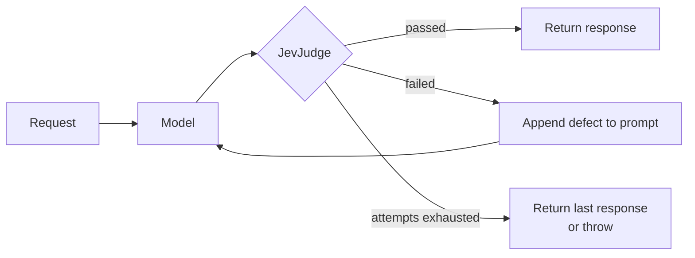

# JevSelfRefineAdvisor

A self-refine `CallAdvisor`: it judges every model response with [`JevJudge`](JevJudge.md)
and, when the response falls short, feeds the defect back into the prompt and tries again.

## How it works



The retry prompt is rebuilt from the **original** request each time rather than from the
previous attempt, so feedback does not compound across attempts.

## Quick Start

```java
ChatClient chatClient = ChatClient.builder(chatModel)
    .defaultTools(new WeatherTools())
    .defaultAdvisors(JevSelfRefineAdvisor.builder()
            .judge(judge)
            .maxRepeatAttempts(3)
            .build())
    .build();

String answer = chatClient.prompt("What is the weather in Paris?").call().content();
```

## Builder Configuration

| Builder method | Type | Default | Description |
|---|---|---|---|
| `judge(JevJudge)` | `JevJudge` | — (**required**) | What to evaluate each response against. |
| `maxRepeatAttempts(int)` | `int` | `3` | Retries after the first attempt. Capped at `MAX_REPEAT_ATTEMPTS_LIMIT` (100). |
| `failOnExhaustedAttempts(boolean)` | `boolean` | `false` | Throw `JevSelfRefineFailedException` instead of returning the best effort. |
| `skipEvaluationPredicate(BiPredicate<ChatClientRequest, ChatClientResponse>)` | — | skips when the response has tool calls | A tool call is not an answer yet, so there is nothing to judge. |
| `judgeErrorPolicy(JudgeErrorPolicy)` | `JudgeErrorPolicy` | `FAIL_OPEN` | What to do when the judging call itself fails. See [when judging fails](#when-judging-fails). |
| `order(int)` | `int` | `LOWEST_PRECEDENCE - 2000` | Where in the advisor chain this runs. |

!!! note "Retry until it passes is not supported"
    `maxRepeatAttempts` is capped deliberately. Each attempt is a model call *plus* a
    judging call, and a criterion the model cannot satisfy would otherwise loop forever.

## What the judge can see

The advisor builds a [`JevJudgeInput`](JevJudge.md#the-state-a-judge-builds) from the
original request and the answer it produced:

| Field | Carries |
|---|---|
| `user_question` | the system message and the user and assistant turns, each prefixed with its role |
| `assistant_answer` | the final answer |
| `tool_calls` | every tool call in the prompt, paired in order with its result: `{name, arguments, result}` |

A `ToolResponseMessage` carries no text of its own, so its results are unpacked into
`tool_calls` rather than dropped. Each result goes to the earliest open call with the same
id, or with the same tool name when the provider leaves ids blank (as Google GenAI does), so
parallel calls and ids reused across turns stay apart. Write a groundedness criterion
against that field:

```java
.noul("is_grounded", Noul.builder()
    .instructions("Is every value in `assistant_answer` supported by a result in `tool_calls`?")
    .whenFalse("States a value no tool returned")
    .build(), 0.7d)
```

Whether a tool was called at all is better settled by a
[code check](JevJudge.md#code-criteria) than asked of Jev.

!!! warning "Advisor order decides what the judge sees, and what a retry can fix"
    In Spring AI 2.x, `ChatClient` runs the tool loop in a `ToolCallingAdvisor` registered at
    `HIGHEST_PRECEDENCE + 300`. Where this advisor sits relative to it is a trade-off:

| Order | The judge sees | A retry |
|---|---|---|
| after it (the default, `LOWEST_PRECEDENCE - 2000`) | every tool call and result, in `tool_calls` | re-asks the model with the same tool history; tools are **not** re-run |
| before it (e.g. `HIGHEST_PRECEDENCE + 100`) | the original prompt and the final answer only; no `tool_calls` | re-runs the whole tool loop, so a tool can return something new |

    Pick *after* when the judge must check the answer against tool results. Pick *before*
    when a failure is best fixed by calling the tools again: the
    [weather demo](../demos.md#modeljudgedemoapplication) does this, because its tool
    returns a different value on each call.

## Failing hard

By default the advisor returns the best effort once attempts run out, which matches
self-refine convention. Turn that around where shipping a rejected answer is worse than
failing:

```java
JevSelfRefineAdvisor.builder()
    .judge(judge)
    .maxRepeatAttempts(2)
    .failOnExhaustedAttempts(true)   // throws JevSelfRefineFailedException
    .build();
```

```java
catch (JevSelfRefineFailedException ex) {
    log.error("gave up: {}", ex.verdict().summary());
    ex.verdict().failures().forEach(f -> log.error("  {}", f.detail()));
}
```

## When judging fails

A TypeSafe outage, timeout or error response says nothing about the answer. By default the
advisor **fails open**: it logs a warning and returns the response it could not judge,
rather than failing a chat call whose answer may be fine. That matches its best-effort
stance on exhausted attempts.

Where an unjudged answer must never ship, fail closed instead. The `TypeSafeException` is
then rethrown:

```java
JevSelfRefineAdvisor.builder()
    .judge(judge)
    .judgeErrorPolicy(JevSelfRefineAdvisor.JudgeErrorPolicy.FAIL_CLOSED)
    .build();
```

Only failures of the judging call are covered. An exception thrown by one of the judge's
code checks is a bug in the check, and always propagates.

## Ordering with the guardrail advisor

The two compose, and they do different jobs.
[`JevGuardrailAdvisor`](../guardrails/JevGuardrailAdvisor.md) defaults to
`LOWEST_PRECEDENCE - 1000`, which runs it *later* — nearer the model — so it screens the
answer self-refinement settled on rather than an intermediate draft.

```java
.defaultAdvisors(
    JevSelfRefineAdvisor.builder().judge(judge).build(),          // quality, retries
    JevGuardrailAdvisor.builder(typeSafeClient).build())          // safety, last word
```

Retrying does not help a guardrail: an unsafe answer is not a draft.

## Streaming

`adviseStream` is unsupported and returns `Flux.error(UnsupportedOperationException)`. A
verdict needs the whole answer, so there is nothing useful to emit incrementally.

## See Also

- [JevJudge](JevJudge.md) — the criteria this advisor evaluates
- [JevGuardrailAdvisor](../guardrails/JevGuardrailAdvisor.md)
- [Demos](../demos.md) — `ModelJudgeDemoApplication`
