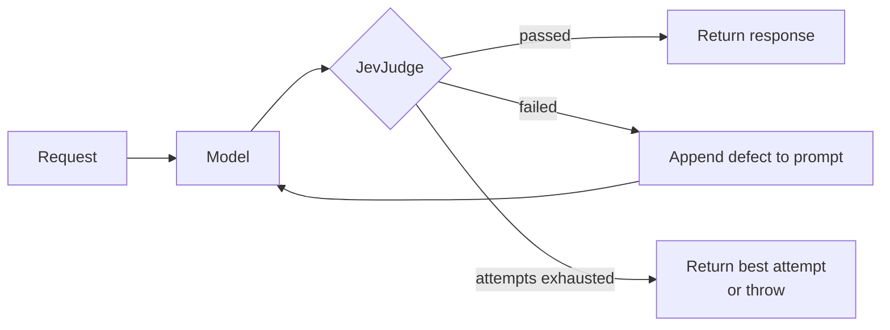

# JevSelfRefineAdvisor

A self-refine `CallAdvisor`: it judges every model response with [`JevJudge`](JevJudge.md)
and, when the response falls short, feeds the defect back into the prompt and tries again.

## How it works



The retry prompt is rebuilt from the **original** request each time rather than from the
previous attempt, so feedback does not compound across attempts.

## Quick Start

```java
ChatClient chatClient = ChatClient.builder(chatModel)
    .defaultTools(new WeatherTools())
    .defaultAdvisors(JevSelfRefineAdvisor.builder()
            .judge(judge)
            .maxRepeatAttempts(3)
            .build())
    .build();

String answer = chatClient.prompt("What is the weather in Paris?").call().content();
```

## Builder Configuration

| Builder method | Type | Default | Description |
|---|---|---|---|
| `judge(JevJudge)` | `JevJudge` | — (**required**) | What to evaluate each response against. |
| `maxRepeatAttempts(int)` | `int` | `3` | Retries after the first attempt. Capped at `MAX_REPEAT_ATTEMPTS_LIMIT` (100). |
| `failOnExhaustedAttempts(boolean)` | `boolean` | `false` | Throw `JevSelfRefineFailedException` instead of returning the best attempt. |
| `skipEvaluationPredicate(BiPredicate<ChatClientRequest, ChatClientResponse>)` | — | skips tool-call responses and `returnDirect` tool results | Neither is the model's answer, so there is nothing to judge. |
| `judgeErrorPolicy(JudgeErrorPolicy)` | `JudgeErrorPolicy` | `FAIL_OPEN` | What to do when the judging call itself fails. See [when judging fails](#when-judging-fails). |
| `order(int)` | `int` | `DEFAULT_ORDER` (`LOWEST_PRECEDENCE - 2000`) | Where in the advisor chain this runs; `BEFORE_TOOLS_ORDER` to re-run tools on a retry. See [where it sits](#where-it-sits-and-why). |

!!! note "Retry until it passes is not supported"
    `maxRepeatAttempts` is capped deliberately. Each attempt is a model call *plus* a
    judging call, and a criterion the model cannot satisfy would otherwise loop forever.

## What the judge can see

The advisor builds a [`JevJudgeInput`](JevJudge.md#the-state-a-judge-builds) from the
original request and the answer it produced:

| Field | Carries |
|---|---|
| `user_question` | the system message and the user and assistant turns, each prefixed with its role |
| `assistant_answer` | the final answer |
| `tool_calls` | the tool calls with their results, `{name, arguments, result}`: read from the prompt at the default order, recorded during the attempt at `BEFORE_TOOLS_ORDER` (see [where it sits](#where-it-sits-and-why)) |

Read from the prompt, a `ToolResponseMessage` carries no text of its own, so its results are
unpacked into `tool_calls` rather than dropped. Each result goes to the earliest open call with the same
id, or with the same tool name when the provider leaves ids blank (as Google GenAI does), so
parallel calls and ids reused across turns stay apart. Tool calls of earlier turns still in
the prompt are included too. Write a groundedness criterion against that field:

```java
.noul("is_grounded", Noul.builder()
    .instructions("Is every value in `assistant_answer` supported by a result in `tool_calls`?")
    .whenFalse("States a value no tool returned")
    .build(), 0.7d)
```

Whether a tool was called at all is better settled by a
[code check](JevJudge.md#code-criteria) than asked of Jev.

## Where it sits, and why

The advisor's position in the chain decides what the judge sees and what a retry can fix.
`ChatClient` registers chat memory at `HIGHEST_PRECEDENCE + 200` and runs the tool loop in a
`ToolCallingAdvisor` at `HIGHEST_PRECEDENCE + 300`. Retrieval
(`RetrievalAugmentationAdvisor`) and most application advisors run at order `0`.

| Order | The judge sees | A retry | Fits |
|---|---|---|---|
| `DEFAULT_ORDER` (`LOWEST_PRECEDENCE - 2000`), inside everything above | the retrieved context and the tool calls, read from the prompt | re-asks the model with the same context and tool history; retrieval and tools are **not** re-run | most chains, and anything with retrieval |
| `BEFORE_TOOLS_ORDER` (`HIGHEST_PRECEDENCE + 250`), between memory and the tool loop | the tool calls, **recorded** during each attempt; **not** the retrieved context | re-runs the tools, so a tool that returned something wrong can return something else | tool-heavy chains without retrieval, where a bad tool result is the usual failure |

Both positions sit inside chat memory, so memory records only the answer finally returned.

At `BEFORE_TOOLS_ORDER` the attempt's tool traffic never reaches this advisor's prompt, so
it is recorded instead: for each attempt, the request's tool callbacks are wrapped, and every
call lands in `tool_calls` with its arguments and result. That position is also outside every
advisor at order `0`: retrieval re-runs on each attempt, with the judge's feedback in its
query, and the judge's `user_question` does not contain the retrieved context.

!!! note "Recorded tools"
    Tools passed as callbacks, through `ChatClient.tools(...)` or `defaultTools(...)`, are
    recorded. A tool resolved by name through a `ToolCallbackResolver` is not. A recorded
    call that threw is noted as `error: <message>`, which may differ from the text the model
    was shown.

A tool marked `returnDirect` hands its output straight back as the response. That is not the
model's answer, so the default `skipEvaluationPredicate` does not judge it, and no retry
re-runs the tool.

## Failing hard

By default the advisor returns the **best attempt** once attempts run out: the one with the
most criteria passed net of those failed, the later one on a tie. A later attempt is not
necessarily a better one, so the last is not returned just for being last; and an attempt
that `failFast` or an unmet dependency left mostly unjudged passes little, so it does not win
by default. Turn that around where shipping a rejected answer is worse than failing:

```java
JevSelfRefineAdvisor.builder()
    .judge(judge)
    .maxRepeatAttempts(2)
    .failOnExhaustedAttempts(true)   // throws JevSelfRefineFailedException
    .build();
```

```java
catch (JevSelfRefineFailedException ex) {
    log.error("gave up: {}", ex.verdict().summary());
    ex.verdict().failures().forEach(f -> log.error("  {}", f.detail()));
}
```

## When judging fails

A TypeSafe outage says nothing about the answer. By default the advisor **fails open** on
transient failures: a connection error or timeout, a 408, 429 or 5xx response. These are
the failures the client itself retries. It logs a warning and returns the response it could
not judge, rather than failing a chat call whose answer may be fine.

A client error, such as a bad API key (401), a missing permission (403) or an invalid
question (400, 422), is a misconfiguration rather than an outage. It is **always rethrown**,
so it cannot silently turn judging off.

Where an unjudged answer must never ship, fail closed instead. Every `TypeSafeException` is
then rethrown:

```java
JevSelfRefineAdvisor.builder()
    .judge(judge)
    .judgeErrorPolicy(JevSelfRefineAdvisor.JudgeErrorPolicy.FAIL_CLOSED)
    .build();
```

Only failures of the judging call are covered. An exception thrown by one of the judge's
code checks is a bug in the check, and always propagates.

## Ordering with the guardrail advisor

The two compose, and they do different jobs.
[`JevGuardrailAdvisor`](../guardrails/JevGuardrailAdvisor.md) defaults to
`LOWEST_PRECEDENCE - 1000`, which places it *inside* the self-refine loop, nearer the model.
It screens every attempt, so an unsafe draft is replaced by the refusal before it is judged.
See [where the guardrail sits](../guardrails/JevGuardrailAdvisor.md#where-it-sits) for the
alternative of screening once per turn.

```java
.defaultAdvisors(
    JevSelfRefineAdvisor.builder().judge(judge).build(),          // quality, retries
    JevGuardrailAdvisor.builder(typeSafeClient).build())          // safety, every attempt
```

Retrying does not help a guardrail: an unsafe answer is not a draft. At these default orders,
an input the guardrail blocks comes back as the refusal, which the judge then scores, and
typically fails. So a blocked request can cost up to `maxRepeatAttempts` further rounds of
screening and judging before the refusal is returned. Ordering the guardrail outside the
self-refine advisor avoids that.

## Streaming

`adviseStream` is unsupported and returns `Flux.error(UnsupportedOperationException)`. A
verdict needs the whole answer, so there is nothing useful to emit incrementally.

## See Also

- [JevJudge](JevJudge.md) — the criteria this advisor evaluates
- [JevGuardrailAdvisor](../guardrails/JevGuardrailAdvisor.md)
- [Demos](../demos.md) — `ModelJudgeDemoApplication`
