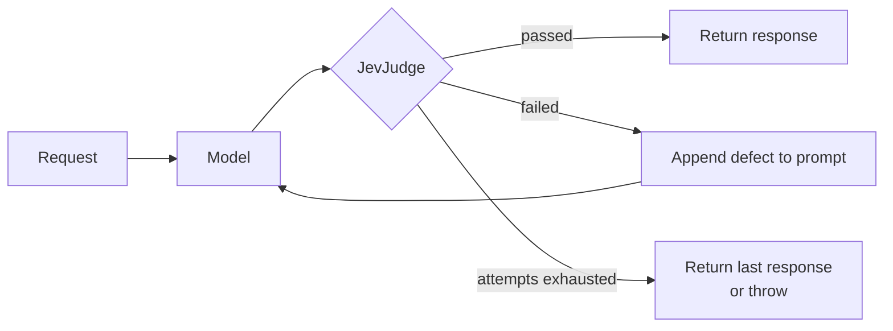

# JevSelfRefineAdvisor

A self-refine `CallAdvisor`: it judges every model response with [`JevJudge`](JevJudge.md)
and, when the response falls short, feeds the defect back into the prompt and tries again.

## How it works



The retry prompt is rebuilt from the **original** request each time rather than from the
previous attempt, so feedback does not compound across attempts.

## Quick Start

```java
ChatClient chatClient = ChatClient.builder(chatModel)
    .defaultTools(new WeatherTools())
    .defaultAdvisors(JevSelfRefineAdvisor.builder()
            .judge(judge)
            .maxRepeatAttempts(3)
            .build())
    .build();

String answer = chatClient.prompt("What is the weather in Paris?").call().content();
```

## Builder Configuration

| Builder method | Type | Default | Description |
|---|---|---|---|
| `judge(JevJudge)` | `JevJudge` | — (**required**) | What to evaluate each response against. |
| `maxRepeatAttempts(int)` | `int` | `3` | Retries after the first attempt. Capped at `MAX_REPEAT_ATTEMPTS_LIMIT` (100). |
| `failOnExhaustedAttempts(boolean)` | `boolean` | `false` | Throw `JevSelfRefineFailedException` instead of returning the best effort. |
| `skipEvaluationPredicate(BiPredicate<ChatClientRequest, ChatClientResponse>)` | — | skips when the response has tool calls | A tool call is not an answer yet, so there is nothing to judge. |
| `order(int)` | `int` | `LOWEST_PRECEDENCE - 2000` | Where in the advisor chain this runs. |

!!! note "Retry until it passes is not supported"
    `maxRepeatAttempts` is capped deliberately. Each attempt is a model call *plus* a
    judging call, and a criterion the model cannot satisfy would otherwise loop forever.

## What the judge can see

The judged state is the prompt on one side and the final answer on the other. Tool results
are included when they are present in the prompt — a `ToolResponseMessage` is unpacked
rather than dropped, since it carries no text of its own.

!!! warning "Internal tool execution hides tool results"
    With Spring AI's default **internal** tool execution the model loop runs inside the
    `ChatModel`, and the intermediate `ToolResponseMessage`s never reach an advisor at all.

    This matters when writing criteria. A groundedness question phrased as *"every claim
    must trace back to the question"* will fail a correct tool-using answer, because the
    value the tool returned legitimately appears nowhere in the question. Either phrase the
    criterion against what is actually visible, or disable internal tool execution so the
    tool messages land in the prompt.

## Failing hard

By default the advisor returns the best effort once attempts run out, which matches
self-refine convention. Turn that around where shipping a rejected answer is worse than
failing:

```java
JevSelfRefineAdvisor.builder()
    .judge(judge)
    .maxRepeatAttempts(2)
    .failOnExhaustedAttempts(true)   // throws JevSelfRefineFailedException
    .build();
```

```java
catch (JevSelfRefineFailedException ex) {
    log.error("gave up: {}", ex.verdict().summary());
    ex.verdict().failures().forEach(f -> log.error("  {}", f.detail()));
}
```

## Ordering with the guardrail advisor

The two compose, and they do different jobs.
[`JevGuardrailAdvisor`](../guardrails/JevGuardrailAdvisor.md) defaults to
`LOWEST_PRECEDENCE - 1000`, which runs it *later* — nearer the model — so it screens the
answer self-refinement settled on rather than an intermediate draft.

```java
.defaultAdvisors(
    JevSelfRefineAdvisor.builder().judge(judge).build(),          // quality, retries
    JevGuardrailAdvisor.builder(typeSafeClient).build())          // safety, last word
```

Retrying does not help a guardrail: an unsafe answer is not a draft.

## Streaming

`adviseStream` is unsupported and returns `Flux.error(UnsupportedOperationException)`. A
verdict needs the whole answer, so there is nothing useful to emit incrementally.

## See Also

- [JevJudge](JevJudge.md) — the criteria this advisor evaluates
- [JevGuardrailAdvisor](../guardrails/JevGuardrailAdvisor.md)
- [Demos](../demos.md) — `ModelJudgeDemoApplication`
